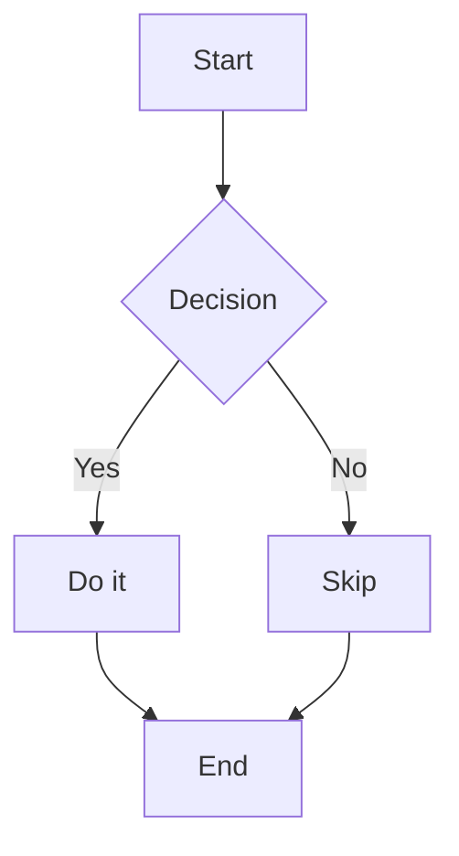

# Dark Mode Markdown Preview

A VS Code extension that renders Markdown files with a rich dark theme, live preview, Mermaid diagram support, and PDF export.

## Features

- **Live preview** — re-renders as you type (300 ms debounce) and on save
- **Dark theme** — deep GitHub-dark-inspired palette (`#0d1117` background, `#c9d1d9` text)
- **Side-by-side mode** — editor on the left, preview on the right
- **Mermaid diagrams** — auto-renders ` ```mermaid ` fences as diagrams
- **PDF export** — opens a print-ready HTML page in your default browser; use File → Print → Save as PDF
- **Copy HTML** — copies the rendered HTML to clipboard
- **Configurable theme** — customize colors, font, and size via VS Code settings

## Commands

| Command | Description |
|---|---|
| `Dark Markdown: Open Preview` | Open rendered preview |
| `Dark Markdown: Open Side by Side Preview` | Editor + preview side by side |
| `Dark Markdown: Export to PDF` | Export current file to PDF |

## Toolbar buttons

Each preview panel has three toolbar buttons:

- **Side by Side** — toggle side-by-side mode
- **Export PDF** — trigger PDF export
- **Copy HTML** — copy rendered HTML to clipboard

## Settings

| Key | Default | Description |
|---|---|---|
| `darkMarkdown.theme.background` | `#0d1117` | Preview background color |
| `darkMarkdown.theme.foreground` | `#c9d1d9` | Preview text color |
| `darkMarkdown.theme.accent` | `#58a6ff` | Accent/link color |
| `darkMarkdown.theme.fontFamily` | `'Segoe UI', system-ui, sans-serif` | Body font |
| `darkMarkdown.theme.fontSize` | `16` | Font size (px) |
| `darkMarkdown.sideBySideByDefault` | `false` | Open side-by-side by default |
| `darkMarkdown.autoRefresh` | `true` | Auto-refresh on changes |

## Development

```bash
npm install
npm run compile
# Press F5 in VS Code to launch Extension Development Host
```

## Packaging

```bash
npm install -g @vscode/vsce
vsce package
```

## Theme palette

| Role | Color |
|---|---|
| Background | `#0d1117` |
| Text | `#c9d1d9` |
| Headings | `#e6edf3` |
| Accent / Links | `#58a6ff` |
| Code background | `#161b22` |
| Borders | `#30363d` |
| Muted text | `#8b949e` |
| Blockquote border | `#3d444d` |

## Mermaid example

````markdown

````

## License

MIT
